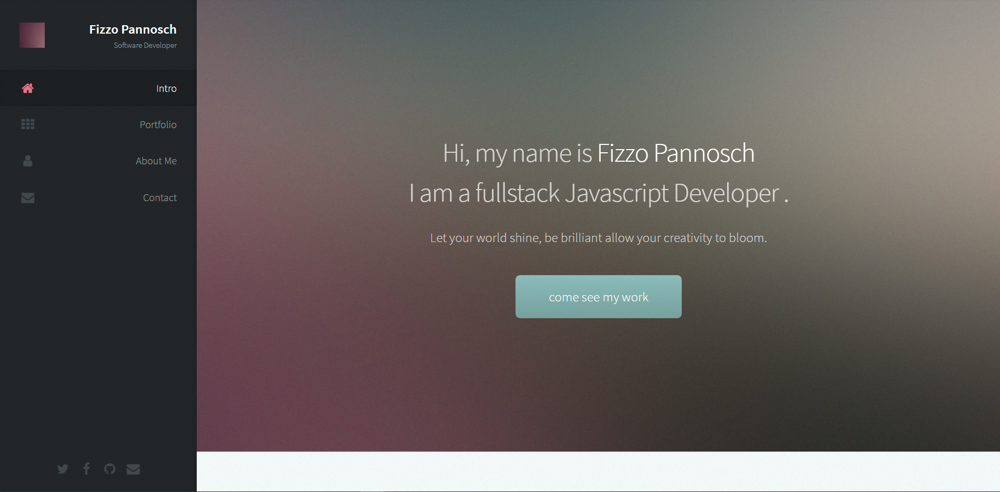
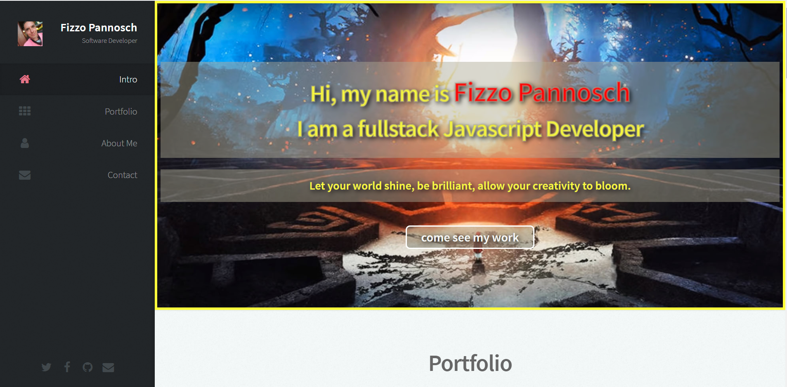
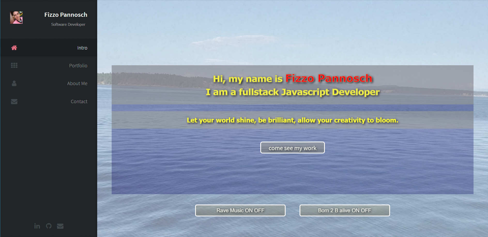

### 
portfolio

##### 
as the title says this is a portfolio website about me and the projects I have created so far.

### 
<a href="fizzo-portfolio2021.herokuapp.com/">link to my deployed site - fizzo-portfolio2021.herokuapp.com/</a>

# 
Fizzo Pannosch

I am a software developer. Resident to the pacific northwest. I have completed my education @Codefellows in Seattle, WA - one of the best coding boot camps in the nation.
I have graduated from 401 Advanced Software Development in JavaScript. I am looking forward to a great career in software development. I love exploring, creating and experiencing the genius mind that lies latent in everyone of us. I love people, I love business and I love creating powerful and beautiful digital products.

#### resources

https://www.youtube.com/watch?v=quFZ99fdKrk
video by Easy Tutorials about how to implement a fullscreen video background

https://scottfalbo.github.io/blackjack/
blackjack game that had audio tags on it - I improved the logic for myself to where each button switches off the other music - so you never hear both at once - no overlap

#### timelog for this site

### 02/19/2021

Number and name of feature: git clone the repo - copy files from codefellows repo to portfolio repo - start familiarizing with this template

Estimate of time needed to complete: 2 HOURS

Start time: 8:00 PM

Finish time: 10.00 PM

Actual time needed to complete: 2 HOURS

### 02/20/2021

Number and name of feature: SMACCSify the 2800 lines of CSS - and styling and personalizing the webite - make it my own

Estimate of time needed to complete: 4 - 6 HOURS

Start time: 4:00 PM

Finish time: 10.00 PM

Actual time needed to complete: 6 HOURS

### 02/21/2021

Number and name of feature: watch youtube video on fullscreen video background and then go hunting for the html and css spot in the existing code to implement it and style it

Estimate of time needed to complete: 3 HOURS

Start time: 10:00 AM

Finish time: 1.00 PM

Actual time needed to complete: 3 HOURS

### 02/21/2021

Number and name of feature: push further to implement audio - Javascript for ON/OFF buttons

Estimate of time needed to complete: 3 HOURS

Start time: 1:00 PM

Finish time: 4.00 PM

Actual time needed to complete: 3 HOURS

## 
BEFORE

---

## 
AFTER

---

## 
AFTER

I had a lot of fun implementing a video background(fullscreen) and 2 audio tracks (implemented separate JS logic to make the on/off buttons and the audio controls work correctly for best user experience)

- [x] implement video backdrop
- [x] implement 2 audio tracks
- [ ] implement media querry for mobile view
